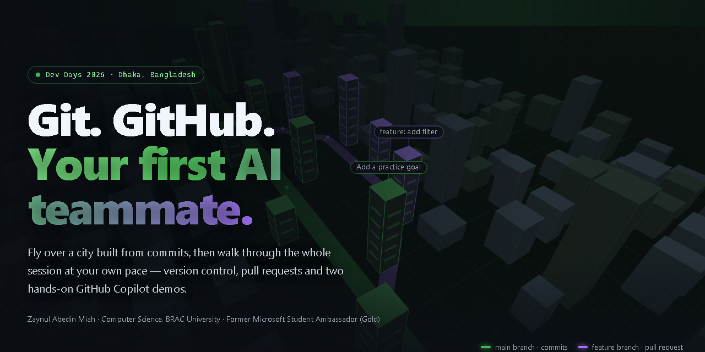

<div align="center">

<a href="https://azaynul10.github.io/Github_DevDays_2026/">
  
</a>

# Git, GitHub & Your First AI Teammate

**Dev Days 2026 · Dhaka, Bangladesh** — session materials by [Zaynul Abedin Miah](https://github.com/azaynul10)

[**Open the interactive guide**](https://azaynul10.github.io/Github_DevDays_2026/) · [Download the slides](Your-First-AI-Teammate-DevDays-Solo.pptx) · [Try Copilot demo 1](#demo-1--explain-test-fix) · [Try Copilot demo 2](#demo-2--add-a-filter)

</div>

---

## Why this repository exists

The live session ran short, so the GitHub Copilot demos never made it to the screen. Everything planned for the talk is here instead — the Git practice, both Copilot demos, and a companion website with a 3D drone flyover of a “repository city” where every tower is a commit.

Work through it at your own pace. Nothing here needs a paid plan.

## What’s inside

| Folder / file | What it is for |
| --- | --- |
| [`git-basics/`](git-basics) | One file, `notes.md`, for your first `git init`, `add`, `diff` and `commit` |
| [`copilot-demo/`](copilot-demo) | An intentionally buggy `prime.py`, its tests, and a small learning-goals web app |
| [`fallback-solutions/`](fallback-solutions) | Hand-written reference answers — try Copilot first |
| [`index.html`](index.html) + [`assets/`](assets) | The companion website (no build step, no libraries) |
| [`Your-First-AI-Teammate-DevDays-Solo.pptx`](Your-First-AI-Teammate-DevDays-Solo.pptx) | The session slides |

## Get started

```bash
git clone https://github.com/azaynul10/Github_DevDays_2026.git
cd Github_DevDays_2026
```

You need [Git](https://git-scm.com/downloads), [Python 3](https://www.python.org/downloads/) for demo 1, a browser for demo 2, and [GitHub Copilot](https://github.com/features/copilot) (the Free or Student plan works) in the Copilot app, VS Code or the CLI.

## Part 1 · Your first two checkpoints

Run these **inside `git-basics/`**, never inside an important project.

```bash
cd git-basics
git init -b main
git status
git add notes.md
git diff --staged
git commit -m "Add learning goals"
```

Add a line such as `- Build one small project.` to `notes.md`, save, then:

```bash
git diff            # working files ↔ staging
git add notes.md
git diff --staged   # staging ↔ last commit
git commit -m "Add a practice goal"
git log --oneline -3
```

> [!TIP]
> After `git add`, plain `git diff` can look empty. The change did not disappear — it moved to staging.

## Part 2 · GitHub Copilot demos

### Demo 1 · Explain, test, fix

`copilot-demo/prime.py` claims that **4 is prime**. Reproduce it first:

```bash
cd copilot-demo
python -m unittest -v test_prime.py   # 1 of 8 tests fails: test_four
```

Then ask Copilot — explanation before any edit:

```text
Explain this Python function in simple terms. Do not edit yet. Why does is_prime(4) return True?
Suggest a minimal fix and tests covering negative numbers, 0, 1, primes and perfect squares.
After I approve the edit, run the tests and show the actual output. If you cannot run them, say so.
```

Approve a small change, re-run the tests, and check that all 8 pass. Stuck? Compare with [`fallback-solutions/prime_fixed.py`](fallback-solutions/prime_fixed.py).

### Demo 2 · Add a filter

Open `copilot-demo/index.html` in a browser, then give Copilot this scoped task:

```text
In the existing index.html, add a labelled case-insensitive text filter for the learning-goals list.
Preserve adding a goal, ignore blank submissions, keep keyboard access, and show a clear no-results
message. Treat user input as text, not HTML. Do not install dependencies, add network calls or change
unrelated files. First explain your plan; then implement the scoped change. Show the diff and a manual
test checklist. Only claim checks passed if you actually ran them.
```

**Accept the change only if:** `git` and `GIT` show the same matches · `zzzz` shows a no-results message · clearing the filter shows every goal · a new matching goal stays visible while filtering. Reference: [`fallback-solutions/index_filtered.html`](fallback-solutions/index_filtered.html).

## Before you accept any AI-assisted change

- [ ] It solves the stated problem
- [ ] Tests actually ran, and they check meaningful behaviour
- [ ] No unexpected files, dependencies, permissions or network calls
- [ ] No secrets or personal data entered the repository
- [ ] You can explain the change in your own words

## Keep learning

- [Dev Days workshops](https://github.github.com/dev-days/) — official hands-on labs for the Copilot app and CLI
- [GitHub Skills](https://skills.github.com) — free guided exercises
- [GitHub Copilot docs](https://docs.github.com/en/copilot)
- [Attendee feedback](https://gh.io/dev-days/feedback) for the Dev Days team

## Run the companion site locally

```bash
python -m http.server 8000
# open http://localhost:8000
```

The 3D flyover is a small hand-written canvas renderer in [`assets/drone.js`](assets/drone.js). It pauses when off-screen and shows a still frame if your system prefers reduced motion.

---

<sub>A community companion for Dev Days Dhaka 2026, not an official GitHub website. GitHub, GitHub Copilot and their logos are trademarks of GitHub, Inc. · Questions or fixes? Open an issue.</sub>
